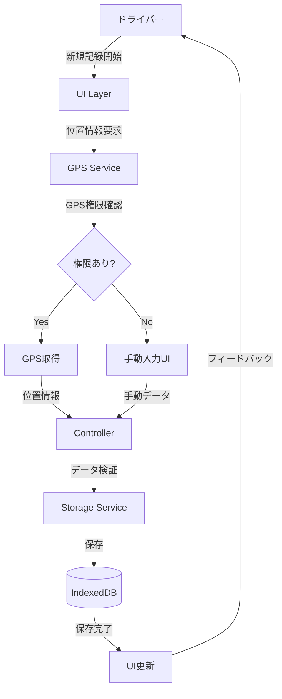
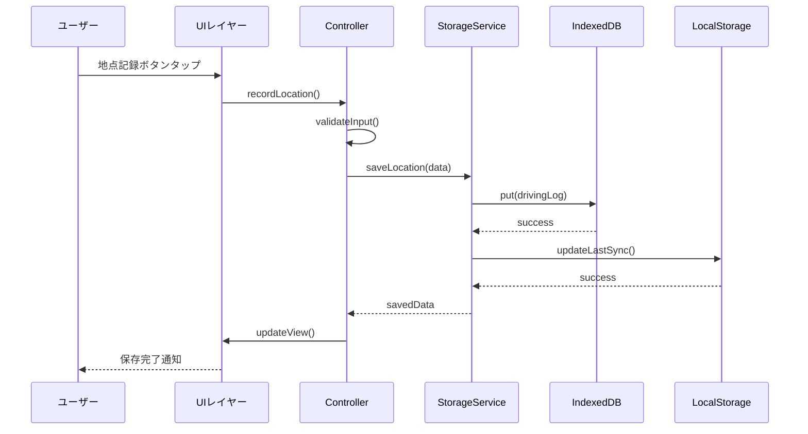
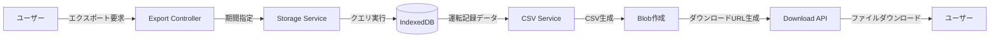
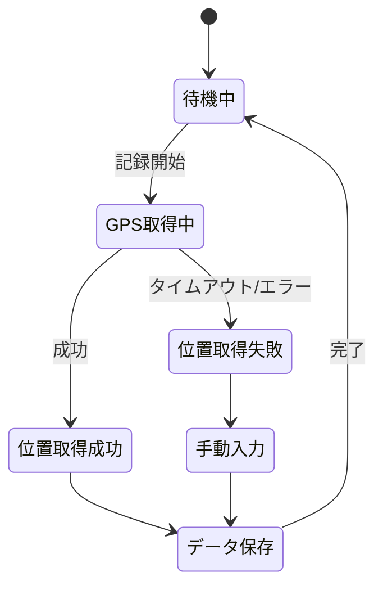
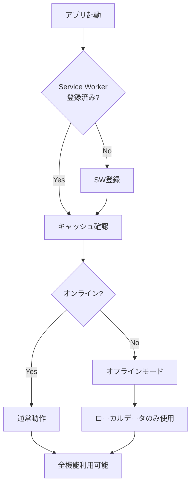
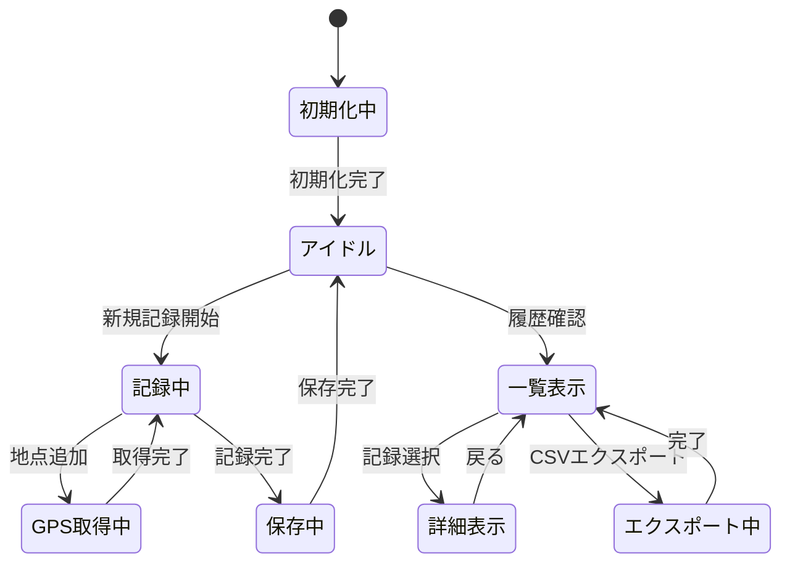
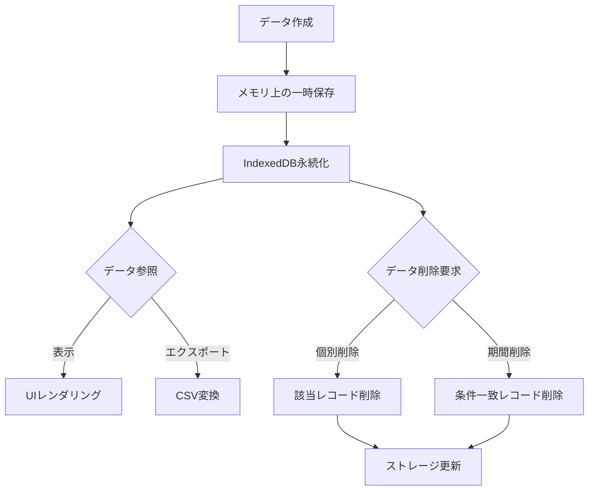
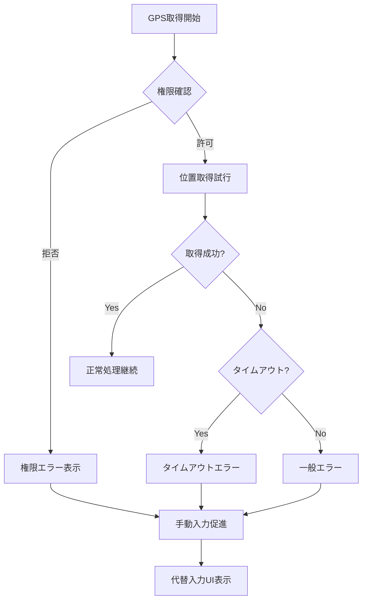
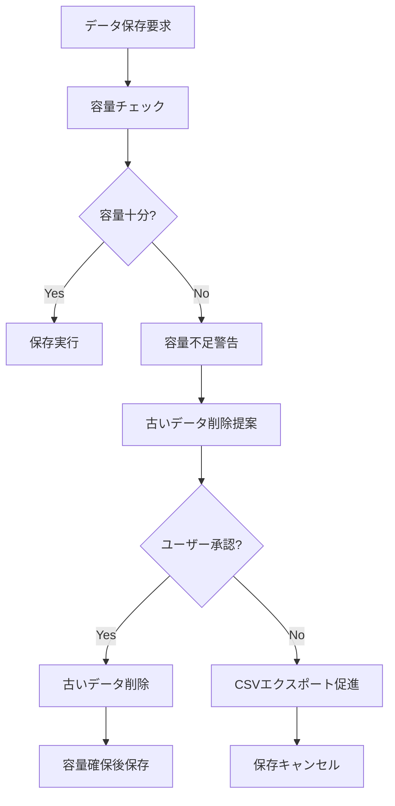

# データフロー図

## ユーザーインタラクションフロー

### 運転記録作成フロー

### データ保存フロー

### CSV エクスポートフロー

## データ処理フロー

### GPS位置情報取得と処理

### オフライン時のデータ管理

## 状態管理フロー

### アプリケーション状態遷移

### データライフサイクル

## エラー処理フロー

### GPS取得エラー時の処理

### ストレージ容量エラー時の処理
