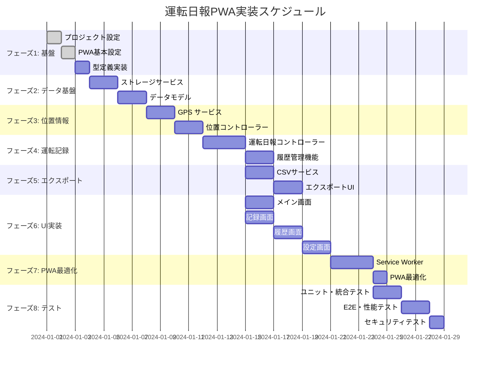

# 運転日報PWA 実装タスク

## 概要

全タスク数: 24
推定作業時間: 52時間
クリティカルパス: TASK-001 → TASK-002 → TASK-003 → TASK-101 → TASK-201 → TASK-202 → TASK-301

## タスク一覧

### フェーズ1: 基盤構築・環境準備

#### TASK-001: プロジェクト初期設定

- [x] **タスク完了**
- **タスクタイプ**: DIRECT
- **要件リンク**: REQ-405, REQ-406
- **依存タスク**: なし
- **実装詳細**:
  - プロジェクト構造の作成
  - package.json設定（TypeScript、ESLint、Prettier、Jest）
  - tsconfig.json設定
  - .gitignore、README作成
- **テスト要件**:
  - [x] ビルド環境の動作確認
  - [x] リント・フォーマッターの動作確認
- **完了条件**:
  - [x] プロジェクト構造が作成されている
  - [x] TypeScriptがコンパイルできる
  - [x] 開発ツールが動作している

#### TASK-002: 基本HTML構造とPWA設定

- [x] **タスク完了**
- **タスクタイプ**: DIRECT
- **要件リンク**: REQ-008, REQ-406
- **依存タスク**: TASK-001
- **実装詳細**:
  - index.htmlの基本構造作成
  - PWAマニフェストファイル作成
  - 基本的なService Worker登録
  - アイコン・画像アセットの準備
- **テスト要件**:
  - [ ] PWAインストール可能性の確認
  - [ ] Service Worker登録の確認
- **完了条件**:
  - [ ] PWAとしてインストール可能
  - [ ] Service Workerが正常に登録される
  - [ ] 基本的なオフライン動作を確認

#### TASK-003: TypeScript型定義実装

- [x] **タスク完了**
- **タスクタイプ**: DIRECT
- **要件リンク**: 全要件（型安全性）
- **依存タスク**: TASK-001
- **実装詳細**:
  - interfaces.tsファイルの実装
  - エンティティ、列挙型、サービスインターフェース
  - エラー定義とイベント定義
- **テスト要件**:
  - [ ] TypeScriptコンパイル確認
  - [ ] 型定義の正確性確認
- **完了条件**:
  - [ ] 全型定義が正しくコンパイルされる
  - [ ] IDE での型補完が動作する

### フェーズ2: データ管理基盤

#### TASK-101: ストレージサービス実装

- [x] **タスク完了**
- **タスクタイプ**: TDD
- **要件リンク**: REQ-103, REQ-407, NFR-302
- **依存タスク**: TASK-003
- **実装詳細**:
  - IndexedDBラッパーの実装
  - LocalStorageアクセス管理
  - データマイグレーション機能
  - エラーハンドリング
- **テスト要件**:
  - [x] 単体テスト: CRUD操作の正確性
  - [x] 単体テスト: エラーハンドリング
  - [x] 統合テスト: データ永続化
  - [x] 性能テスト: 大量データ処理（1000件）
- **エラーハンドリング**:
  - [x] ストレージ容量不足
  - [x] データベース接続エラー
  - [x] データ形式エラー
- **完了条件**:
  - [x] IndexedDB操作が安定動作
  - [x] LocalStorage操作が正常動作
  - [x] エラー時の適切な回復処理

#### TASK-102: データモデル実装

- [ ] **タスク完了**
- **タスクタイプ**: TDD
- **要件リンク**: REQ-001, REQ-002, REQ-003
- **依存タスク**: TASK-101
- **実装詳細**:
  - DrivingLogモデル実装
  - Locationモデル実装
  - Settingsモデル実装
  - バリデーション機能
- **テスト要件**:
  - [ ] 単体テスト: モデル作成・更新
  - [ ] 単体テスト: バリデーション機能
  - [ ] 単体テスト: データ変換
- **完了条件**:
  - [ ] 全モデルが正しく動作
  - [ ] バリデーションが適切に実行
  - [ ] データ整合性が保たれる

### フェーズ3: 位置情報機能

#### TASK-201: GPS サービス実装

- [ ] **タスク完了**
- **タスクタイプ**: TDD
- **要件リンク**: REQ-004, REQ-101, NFR-001
- **依存タスク**: TASK-102
- **実装詳細**:
  - GPS位置情報取得機能
  - 権限管理
  - タイムアウト処理
  - 精度チェック機能
- **テスト要件**:
  - [ ] 単体テスト: GPS取得ロジック
  - [ ] 単体テスト: エラーハンドリング
  - [ ] 統合テスト: 権限許可・拒否フロー
  - [ ] 性能テスト: 5秒以内の取得
- **エラーハンドリング**:
  - [ ] GPS権限拒否
  - [ ] GPS取得タイムアウト
  - [ ] GPS利用不可
  - [ ] 低精度警告（50m超）
- **UI/UX要件**:
  - [ ] GPS取得中のローディング表示
  - [ ] 権限要求の適切な説明
  - [ ] エラー時の代替手段提示
- **完了条件**:
  - [ ] GPS情報を5秒以内に取得
  - [ ] 権限管理が適切に動作
  - [ ] エラー時の適切なフォールバック

#### TASK-202: 位置情報コントローラー実装

- [ ] **タスク完了**
- **タスクタイプ**: TDD
- **要件リンク**: REQ-001, REQ-002, REQ-003
- **依存タスク**: TASK-201
- **実装詳細**:
  - 地点記録機能
  - 手動入力機能
  - よく使う地点管理
  - 位置情報の検索・フィルタリング
- **テスト要件**:
  - [ ] 単体テスト: 地点記録ロジック
  - [ ] 単体テスト: 手動入力処理
  - [ ] 統合テスト: GPS→手動入力フロー
- **UI/UX要件**:
  - [ ] 地点入力フォームの使いやすさ
  - [ ] よく使う地点の選択UI
  - [ ] 入力支援機能
- **完了条件**:
  - [ ] GPS・手動両方で地点記録可能
  - [ ] よく使う地点機能が動作
  - [ ] 入力バリデーションが適切

### フェーズ4: 運転記録機能

#### TASK-301: 運転日報コントローラー実装

- [ ] **タスク完了**
- **タスクタイプ**: TDD
- **要件リンク**: REQ-001, REQ-002, REQ-003, REQ-105
- **依存タスク**: TASK-202
- **実装詳細**:
  - 運転記録の作成・更新・削除
  - 記録状態管理（進行中/完了/キャンセル）
  - 簡易入力モード（ワンタップ）
  - 記録の自動保存機能
- **テスト要件**:
  - [ ] 単体テスト: CRUD操作
  - [ ] 単体テスト: 状態遷移
  - [ ] 統合テスト: 記録完了フロー
  - [ ] 統合テスト: 中断・復旧テスト
- **エラーハンドリング**:
  - [ ] アプリクラッシュ時の復旧
  - [ ] 不正な状態遷移の防止
  - [ ] 未来日時の警告
- **UI/UX要件**:
  - [ ] 進行状況の可視化
  - [ ] ワンタップ記録の大きなボタン
  - [ ] 記録中断時の確認ダイアログ
- **完了条件**:
  - [ ] 運転記録が正しく管理される
  - [ ] 状態遷移が適切に動作
  - [ ] クラッシュ復旧機能が動作

#### TASK-302: 履歴管理機能実装

- [ ] **タスク完了**
- **タスクタイプ**: TDD
- **要件リンク**: REQ-006, NFR-002
- **依存タスク**: TASK-301
- **実装詳細**:
  - 運転記録一覧表示
  - 検索・フィルタリング機能
  - ページネーション・仮想スクロール
  - 詳細表示機能
- **テスト要件**:
  - [ ] 単体テスト: 検索・フィルタ機能
  - [ ] 性能テスト: 1000件データで2秒以内表示
  - [ ] UI テスト: 仮想スクロール動作
- **UI/UX要件**:
  - [ ] 日付・期間での絞り込み
  - [ ] ステータス別フィルタリング
  - [ ] モバイルでのスクロール最適化
  - [ ] 空状態の適切な表示
- **完了条件**:
  - [ ] 大量データを高速表示
  - [ ] 検索・フィルタが正常動作
  - [ ] レスポンシブデザイン対応

### フェーズ5: エクスポート機能

#### TASK-401: CSVサービス実装

- [ ] **タスク完了**
- **タスクタイプ**: TDD
- **要件リンク**: REQ-007, REQ-104, NFR-003
- **依存タスク**: TASK-302
- **実装詳細**:
  - CSV生成ライブラリ実装
  - エクスポートオプション機能
  - 個人情報フィルタリング
  - 期間指定エクスポート
- **テスト要件**:
  - [ ] 単体テスト: CSV生成の正確性
  - [ ] 単体テスト: フィルタリング機能
  - [ ] 性能テスト: 3000件データで10秒以内
- **エラーハンドリング**:
  - [ ] ファイル生成失敗
  - [ ] ブラウザAPI制限
  - [ ] 代替ダウンロード方法
- **完了条件**:
  - [ ] 正確なCSV生成
  - [ ] プライバシー保護適用
  - [ ] 大量データの高速処理

#### TASK-402: エクスポートコントローラー実装

- [ ] **タスク完了**
- **タスクタイプ**: TDD
- **要件リンク**: REQ-007, NFR-103
- **依存タスク**: TASK-401
- **実装詳細**:
  - エクスポート設定UI
  - ダウンロード機能
  - プログレス表示
  - エラー処理
- **テスト要件**:
  - [ ] 統合テスト: エクスポートフロー
  - [ ] UI テスト: プログレス表示
  - [ ] エラーテスト: ダウンロード失敗
- **UI/UX要件**:
  - [ ] エクスポート設定の分かりやすい UI
  - [ ] プログレスバー表示
  - [ ] ダウンロード完了通知
  - [ ] エラー時の再試行オプション
- **完了条件**:
  - [ ] CSVダウンロードが正常動作
  - [ ] エクスポート設定が保存される
  - [ ] エラー時の適切な対応

### フェーズ6: UI・画面実装

#### TASK-501: メイン画面（ダッシュボード）実装

- [ ] **タスク完了**
- **タスクタイプ**: TDD
- **要件リンク**: REQ-008, NFR-201, NFR-202
- **依存タスク**: TASK-301
- **実装詳細**:
  - ダッシュボード画面のHTML/CSS
  - 新規記録開始ボタン
  - 最近の記録一覧
  - ナビゲーション
- **テスト要件**:
  - [ ] コンポーネントテスト: 基本表示
  - [ ] レスポンシブテスト: 各画面サイズ
  - [ ] アクセシビリティテスト
- **UI/UX要件**:
  - [ ] 44x44px以上のタップ領域
  - [ ] 片手操作可能なレイアウト
  - [ ] 日本語UI表示
  - [ ] ローディング状態の表示
- **アクセシビリティ要件**:
  - [ ] セマンティックHTML使用
  - [ ] ARIA属性適用
  - [ ] キーボードナビゲーション対応
  - [ ] スクリーンリーダー対応
- **完了条件**:
  - [ ] レスポンシブデザイン適用
  - [ ] アクセシビリティ基準達成
  - [ ] タッチインターフェース最適化

#### TASK-502: 運転記録画面実装

- [ ] **タスク完了**
- **タスクタイプ**: TDD
- **要件リンク**: REQ-105, REQ-202, NFR-201
- **依存タスク**: TASK-301, TASK-501
- **実装詳細**:
  - 記録進行画面のUI
  - GPS状態インジケーター
  - 地点追加ボタン群
  - プログレス表示
- **テスト要件**:
  - [ ] コンポーネントテスト: 状態表示
  - [ ] インタラクションテスト: ボタン操作
  - [ ] 統合テスト: GPS→記録フロー
- **UI/UX要件**:
  - [ ] GPS取得中の視覚的表示
  - [ ] 大きなタップターゲット（運転中対応）
  - [ ] 明確な進行状況表示
  - [ ] エラー状態の適切な表示
- **完了条件**:
  - [ ] 運転中でも安全に操作可能
  - [ ] GPS状態が明確に表示される
  - [ ] 記録フローがスムーズ

#### TASK-503: 履歴一覧・詳細画面実装

- [ ] **タスク完了**
- **タスクタイプ**: TDD
- **要件リンク**: REQ-006, NFR-002
- **依存タスク**: TASK-302, TASK-501
- **実装詳細**:
  - 履歴一覧のUI
  - 検索・フィルターUI
  - 詳細表示画面
  - 削除・編集機能
- **テスト要件**:
  - [ ] コンポーネントテスト: 一覧表示
  - [ ] パフォーマンステスト: 仮想スクロール
  - [ ] インタラクションテスト: 編集・削除
- **UI/UX要件**:
  - [ ] 高速スクロール対応
  - [ ] 直感的な検索インターフェース
  - [ ] 削除前の確認ダイアログ
  - [ ] 空状態の適切な表示
- **完了条件**:
  - [ ] 大量データの高速表示
  - [ ] 使いやすい検索・フィルター
  - [ ] データ操作が安全

#### TASK-504: 設定画面実装

- [ ] **タスク完了**
- **タスクタイプ**: TDD
- **要件リンク**: REQ-301, NFR-203
- **依存タスク**: TASK-402, TASK-501
- **実装詳細**:
  - 設定画面のUI
  - よく使う地点管理
  - エクスポート設定
  - データ管理機能
- **テスト要件**:
  - [ ] コンポーネントテスト: 設定項目
  - [ ] 統合テスト: 設定保存・読み込み
  - [ ] データテスト: データ削除機能
- **UI/UX要件**:
  - [ ] 分かりやすい設定項目
  - [ ] データ削除の慎重な確認
  - [ ] よく使う地点の管理UI
- **完了条件**:
  - [ ] 設定が正しく保存・反映される
  - [ ] データ管理が安全に実行される
  - [ ] よく使う地点機能が便利

### フェーズ7: Service Worker・PWA最適化

#### TASK-601: Service Worker実装

- [ ] **タスク完了**
- **タスクタイプ**: TDD
- **要件リンク**: REQ-406, NFR-301, NFR-303
- **依存タスク**: TASK-004（全画面完成後）
- **実装詳細**:
  - アプリシェルキャッシュ
  - オフラインリクエスト処理
  - キャッシュ更新戦略
  - バックグラウンド同期
- **テスト要件**:
  - [ ] ユニットテスト: キャッシュ戦略
  - [ ] 統合テスト: オフライン動作
  - [ ] エンドツーエンドテスト: PWAライフサイクル
- **エラーハンドリング**:
  - [ ] キャッシュ失敗時の対応
  - [ ] ストレージ容量不足
  - [ ] Service Worker更新失敗
- **完了条件**:
  - [ ] 完全オフライン動作実現
  - [ ] キャッシュ戦略が適切に動作
  - [ ] PWA更新が正常動作

#### TASK-602: PWA最適化・アイコン・マニフェスト

- [ ] **タスク完了**
- **タスクタイプ**: DIRECT
- **要件リンク**: REQ-008, REQ-403
- **依存タスク**: TASK-601
- **実装詳細**:
  - アプリアイコンの作成（各サイズ）
  - マニフェストファイル最適化
  - スプラッシュスクリーン設定
  - ショートカット設定
- **テスト要件**:
  - [ ] PWAインストールテスト
  - [ ] アイコン表示確認
  - [ ] 各デバイスでの表示確認
- **UI/UX要件**:
  - [ ] 美しいアプリアイコン
  - [ ] 適切なスプラッシュスクリーン
  - [ ] 有用なショートカット機能
- **完了条件**:
  - [ ] PWAとして完全に動作
  - [ ] 各プラットフォームで適切表示
  - [ ] ユーザー体験が向上

### フェーズ8: テスト・品質保証

#### TASK-701: ユニット・統合テスト整備

- [ ] **タスク完了**
- **タスクタイプ**: TDD
- **要件リンク**: 全要件（品質保証）
- **依存タスク**: 各フェーズ完了後
- **実装詳細**:
  - 全モジュールのユニットテスト
  - 統合テストスイート
  - テストカバレッジ向上
  - モックとスタブの整備
- **テスト要件**:
  - [ ] ユニットテストカバレッジ80%以上
  - [ ] 統合テストで主要フロー網羅
  - [ ] エラーハンドリングテスト
- **完了条件**:
  - [ ] 高いテストカバレッジ達成
  - [ ] CI/CD パイプライン構築
  - [ ] 自動テスト実行環境

#### TASK-702: E2Eテスト・パフォーマンステスト

- [ ] **タスク完了**
- **タスクタイプ**: TDD
- **要件リンク**: 全非機能要件
- **依存タスク**: TASK-701
- **実装詳細**:
  - E2Eテストスイート（Playwright/Cypress）
  - パフォーマンス測定
  - ブラウザ互換性テスト
  - モバイルデバイステスト
- **テスト要件**:
  - [ ] 主要ユーザーフローのE2Eテスト
  - [ ] パフォーマンス要件の確認
  - [ ] 各ブラウザでの動作確認
  - [ ] モバイルデバイスでの動作確認
- **完了条件**:
  - [ ] 全要件をE2Eテストで確認
  - [ ] パフォーマンス基準達成
  - [ ] 互換性問題の解決

#### TASK-703: セキュリティ・アクセシビリティテスト

- [ ] **タスク完了**
- **タスクタイプ**: TDD  
- **要件リンク**: NFR-101, NFR-102, NFR-103
- **依存タスク**: TASK-702
- **実装詳細**:
  - セキュリティ監査
  - アクセシビリティ監査
  - プライバシー保護確認
  - データ漏洩防止確認
- **テスト要件**:
  - [ ] セキュリティスキャン実行
  - [ ] WCAG 2.1 AA準拠確認
  - [ ] データ保護機能テスト
- **完了条件**:
  - [ ] セキュリティ脆弱性ゼロ
  - [ ] アクセシビリティ基準達成
  - [ ] プライバシー保護適切

## 実行順序

## マイルストーン

1. **M1: 基盤完了** (Day 3) - プロジェクト基盤とPWA基本機能
2. **M2: データ基盤完了** (Day 7) - ストレージとデータモデル
3. **M3: コア機能完了** (Day 13) - GPS・運転記録・履歴機能
4. **M4: UI完了** (Day 19) - 全画面実装完了
5. **M5: PWA完了** (Day 23) - Service Worker・オフライン対応
6. **M6: リリース準備完了** (Day 26) - 全テスト完了・本番準備

## 並行実行可能タスク

- **フェーズ5・6**: エクスポート機能とUI実装は一部並行可能
- **フェーズ6**: 各画面実装は独立して並行実行可能
- **フェーズ8**: テスト作業は機能実装と並行して進行可能

## 重要な注意事項

1. **TDDプロセス**: TDDタスクは必ずテストファーストで実装
2. **PWA要件**: 各フェーズでオフライン動作を念頭に実装
3. **モバイル最適化**: UI実装時は常にモバイルファーストで設計
4. **セキュリティ**: 位置情報取り扱いは慎重に実装
5. **パフォーマンス**: 大量データ処理は常に性能を意識して実装